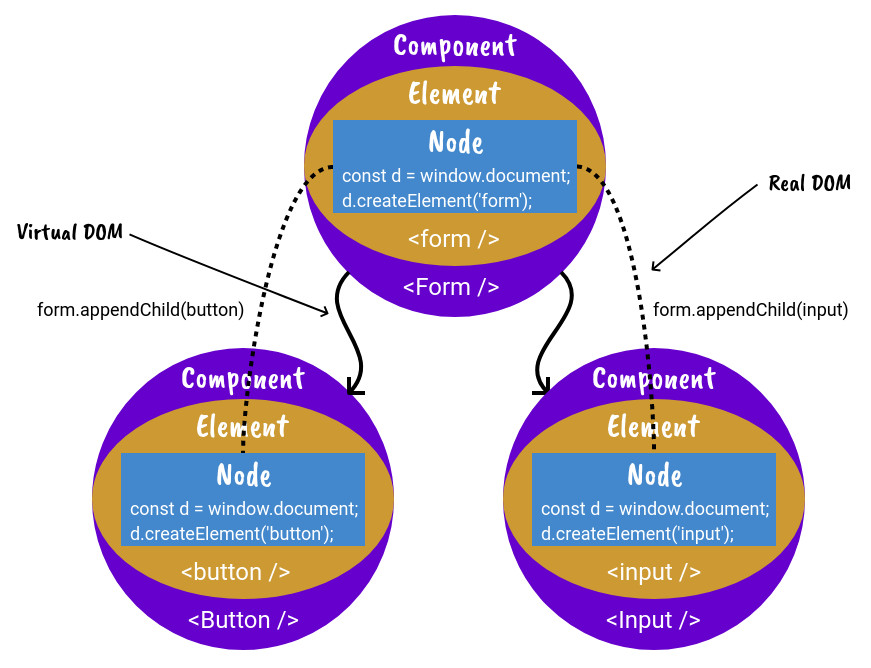

# create-react-renderer

> learn to build a custom react renderer


Please ★ this repo if you found it useful ★ ★ ★

Built against **react 19** and **react-reconciler 0.33**.

### Watch the Video Below

[](https://www.youtube.com/embed/SXx-CymMjDM)

DISCLAIMER: These definitions are not official. They are based on my own understanding of react renderers.
They are not intended for understanding how to use react, but rather are for providing the context of
understanding how a react renderer works.

_The video and the [slides](/slides) were recorded against react 16, so some method names differ from
the current code. The concepts are unchanged; see the notes below for what moved._

## Built by BitSpur

BitSpur offers premium Node and React development and support services. Get in touch at
[bitspur.com](https://bitspur.com).

## Setup

```sh
make prepare  # one time machine setup (asdf toolchain + pnpm install)
```

or, if you already have node and pnpm

```sh
pnpm install
```

## Usage

```sh
make build  # typecheck every phase
make test   # run every phase's tests with coverage
make lint   # oxfmt --check + oxlint
make format # format with oxfmt
```

Run a phase's demo from inside the phase

```sh
cd phaseA
pnpm start
```

## React Renderer Bindings Diagram

The diagram represents the following code

```jsx
<Form>
  <Button />
  <Input />
</Form>
```



## Definitions

### Virtual DOM

A tree structure that represents the current rendered state. Every branch and leaf on the tree is either a
component or element.

### Reconciliation

**Reconciliation** is the process of determining which parts of the virtual dom need to be changed
by diffing the current virtual dom tree with the new virtual dom tree.

### Reconciler

The **reconciler** is the bindings to the react reconciliation lifecycle methods. This is NOT the react
lifecycle hooks even though it is closely related to the react lifecycle hooks.

### Fiber

A **fiber** is a virtual stack frame of work for the react reconciler. You can think of it as the low level api the
reconciler is built on top of.

### Node

A **node** is the interface of the renderer that the react renderer is binding to. For example
`window.document` would be the **node** used in a react renderer that binds to the dom.

### Root Node

The **root node** is the node used in the top of the react virtual dom tree.

### Element

You can think of an **element** as a react component that is directly bound to the reconciliation lifecycle methods.
This is NOT the same thing as a react component, although it can be used like a react component.
Because it is directly bound to the react reconciliation lifecycle methods it is more powerful, but also more complex.
**Elements** form the foundation that all react components are built on top of.

`<div>`, `<button>` and `<h1>` are all examples of elements in the react dom renderer.

### Base Element

The **base element** is the element all other elements inherit from.

### Component

An encapsulation of components and/or elements.

### Root Element

The **root element** is the element used in the top of the react virtual dom tree. This element is
not created with JSX but is initialized during the initial render.

### Root

This represents the root of the react virtual dom tree.

## The modern host config (react-reconciler 0.33)

The reconciler api changed significantly since this tutorial was first recorded. The important
differences baked into the phases are listed below.

### No more prepareUpdate

`prepareUpdate` was removed. `commitUpdate` now receives the old and new props directly instead of
an update payload.

```ts
commitUpdate(
  instance: Instance,
  type: Type,
  oldProps: Props,
  newProps: Props,
  internalHandle: any,
): void {
  return instance.commitUpdate(newProps);
}
```

### Update priorities replaced the deferred callbacks

`scheduleDeferredCallback`, `cancelDeferredCallback`, `shouldDeprioritizeSubtree` and `now` are gone.
The host config instead tracks an update priority for react.

```ts
setCurrentUpdatePriority(newPriority: number): void {
  currentUpdatePriority = newPriority;
},
getCurrentUpdatePriority(): number {
  return currentUpdatePriority;
},
resolveUpdatePriority(): number {
  if (currentUpdatePriority !== NoEventPriority) return currentUpdatePriority;
  return DefaultEventPriority;
},
```

### Concurrent roots and synchronous rendering

React 19 only exposes concurrent roots, so a renderer that wants a synchronous render (like this
one) creates the container with `ConcurrentRoot` and drives the work to completion itself.

```ts
const root = reconciler.createContainer(
  rootElement,
  ConcurrentRoot,
  null, // hydration callbacks
  false, // strict mode
  null, // concurrent updates override
  "create_react_renderer_", // identifier prefix
  (error: Error) => {
    throw error; // onUncaughtError
  },
  (error: Error) => console.warn(error), // onCaughtError
  (error: Error) => console.warn(error), // onRecoverableError
  () => undefined, // onDefaultTransitionIndicator
);
reconciler.updateContainerSync(element, root, null, () => undefined);
reconciler.flushSyncWork();
```

### Required plumbing

The host config must also implement microtask scheduling (`supportsMicrotasks` +
`scheduleMicrotask`), transition support (`NotPendingTransition`, `HostTransitionContext`,
`shouldAttemptEagerTransition`), the suspense commit hooks (`maySuspendCommit`, `preloadInstance`,
`startSuspendingCommit`, `suspendInstance`, `waitForCommitToBeReady`) and a handful of instance
hooks (`getInstanceFromNode`, `getInstanceFromScope`, `detachDeletedInstance`, ...). These exist as
logged stubs from [phaseA](/phaseA) so every phase renders under react 19.

## Phases

### [Phase A](/phaseA)

setup the reconciler

### [Phase B](/phaseB)

create some custom elements

### [Phase C](/phaseC)

bind some custom elements to reconciler

### [Phase D](/phaseD)

setup node

### [Phase E](/phaseE)

bind base element lifecycle methods

### [Phase F](/phaseF)

bind critical element lifecycle methods to reconciler lifecycle methods

### [Phase G](/phaseG)

create base elements

### [Phase H](/phaseH)

create text bindings

### [Phase I](/phaseI)

finish reconciler bindings

### [Phase J](/phaseJ)

add default props

### [Phase K](/phaseK)

add options

### [Phase L](/phaseL)

create components

## Tips

### Abstraction is your friend

Try to start small. Build your renderer in many layers of abstraction.
This renderer uses the following layers of abstraction.

`reconciler` <- `BaseElement` <- `elements` <- `components` <- `more components`

### Few elements, lots of components

Elements are hard to build and hard to debug. It's best to have a few broad and general elements
and then build lots of specific components on top of the broad elements.

### Start small, increment in small steps

### Use typescript

This can catch lots of unnecessary bugs.

### Test test test (unit test)

### Build a solid foundation

## Debugging

Understanding the react lifecycle can really help with debugging.

### Ref debugging

You can get access to the node data from a ref. For example, the following will log the data
from the node used in the `<Smart />` element. This is very helpful because the ref runs
before the entire render cycle is finished. This is helpful for debugging bugs that are
preventing rendering from finishing.

```tsx
<Smart code="const hello = 'world'" ref={(ref: any) => console.log(ref.node)} />
```

This only works on element refs. Since elements are abstractions of your nodes, you can't see the
value of nodes in component refs.

For example, the following would log `undefined`

```tsx
<FunctionDeclaration name="hello" ref={(ref: any) => console.log(ref.node)} />
```
